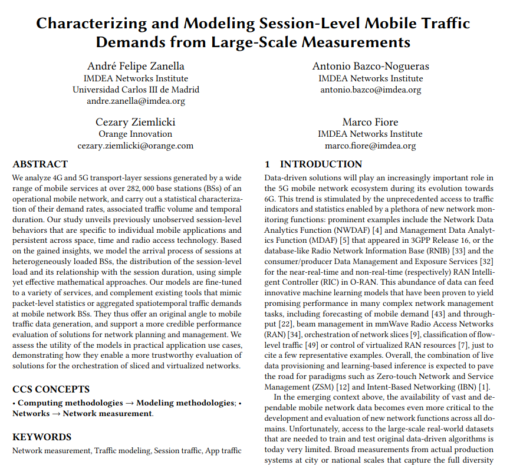

# Session-level traffic statistics and models

This page contains the coefficients obtained on the work ***Characterizing and Modeling Session-Level Mobile Traffic Demands from Large-Scale Measurements***, presented at ACM IMC 2023. We also present a example on how to generate samples. We present models for 30 different services observed at the production network of a large mobile operator in France, with all values representing transport layer session-level statitics. 

DOI link: https://doi.org/10.1145/3618257.3624825

In case of doubts, please contact andre.zanella@imdea.org

## Models included

Here's a brief description on what's included on this page. 

### 1. Share of sessions and traffic across apps:
For every app, what was the percentage of sessions and traffic

### 2. Session arrival rate distribution
Considering all antennas included on our study, we present 10 sampled ones ranked by their traffic load, with $0.1$ having the lowest load and $1.0$ the highest

## Acknowledgements
This work was supported by BANYAN project, which received funding from the European Union’s Horizon 2020 research and innovation program under grant agreement no. 860239; by NetSense, grant no. 2019-T1/TIC-16037 funded by Comunidad de Madrid; by the research project CoCo5G (Traffic Collection, Contextual Analysis, Data-driven Optimization for 5G), grant no. ANR-22-CE25-0016, funded by the French National Research Agency (ANR); and by the Regional Government of Madrid through the grant 2020-T2/TIC-20710 for Talent Attraction. 
